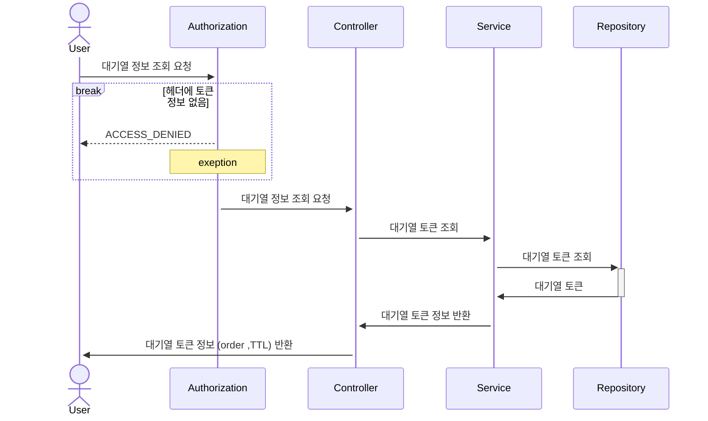
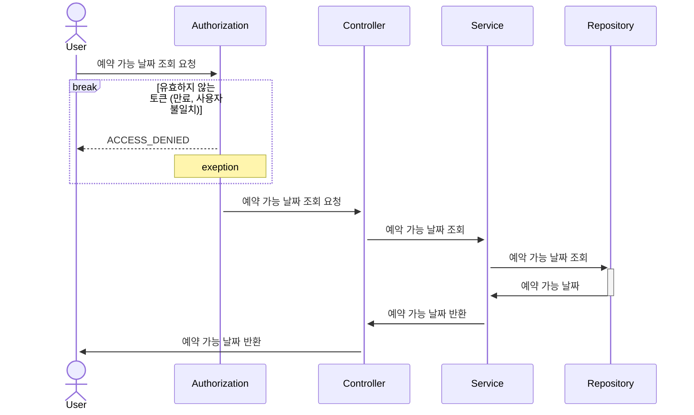
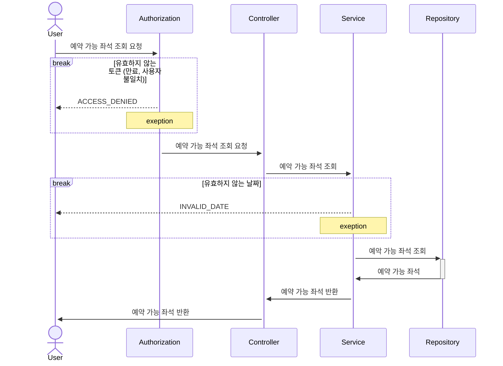
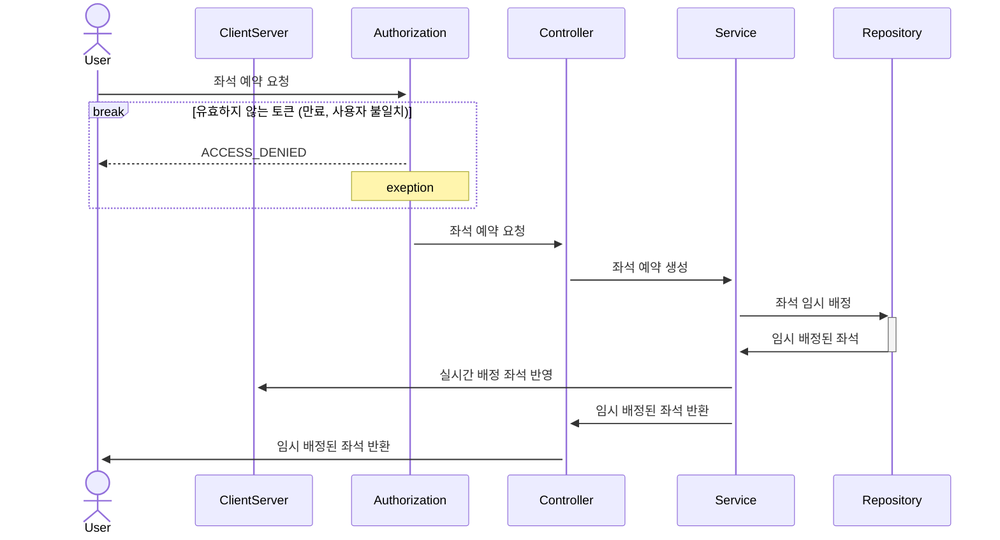
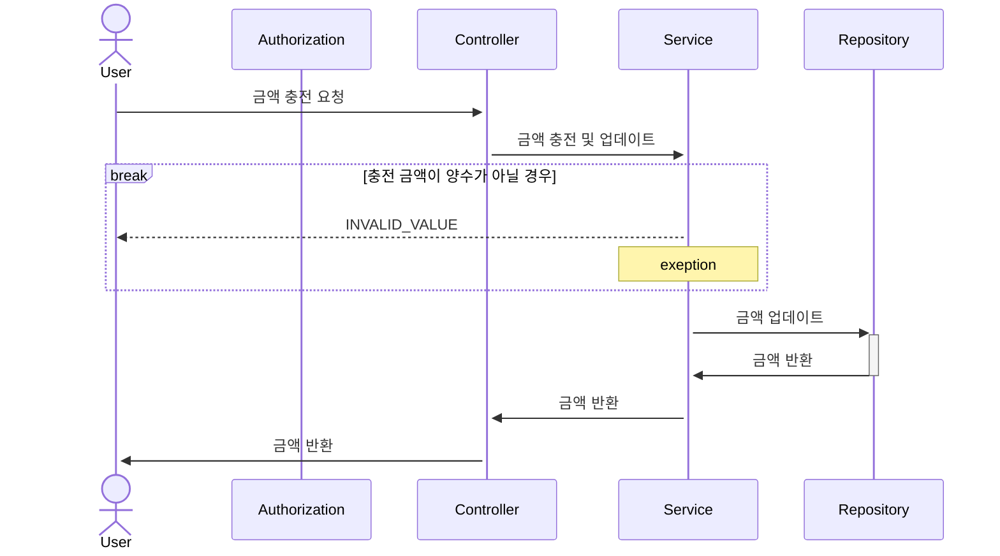
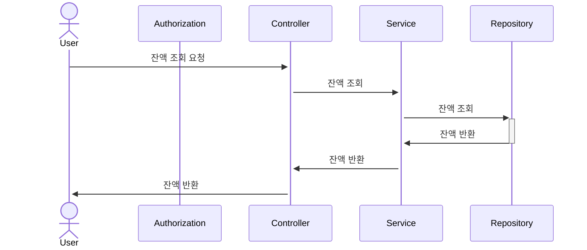
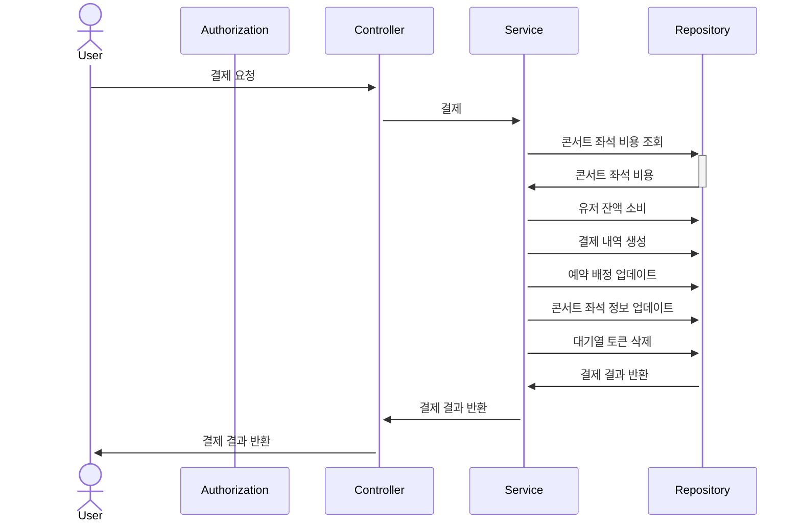

```mermaid
    flowchart LR
    ConcertView[콘서트 조회] --> ConcertSelect[콘서트 선택] 
    ConcertSelect --> CheckWaiting1{현재 대기 순서인가?}
    CheckWaiting1 --> |Yes| ConcertDateView[예약 가능한 날짜 조회]
    CheckWaiting1 --> |No| Wait1[대기] --> CheckWaiting1
    
    ConcertDateView[예약 가능한 날짜 조회] --> ConcertDateSelect[콘서트 예약 날짜 선택]
    ConcertDateSelect --> CheckWaiting2-1{예약 가능한 날짜인가?}
    CheckWaiting2-1 --> |Yes| CheckWaiting2-2{현재 대기 순서인가?}
    CheckWaiting2-1 --> |No| ConcertDateSelect
    CheckWaiting2-2 --> |Yes| ConcertSeatView[예약 가능한 좌석 조회]
    CheckWaiting2-2 --> |No| Wait2[대기] --> CheckWaiting2-2
    
    ConcertSeatView --> ConcertSeatSelect[콘서트 임시 배정 좌석 선택]
    ConcertSeatSelect --> CheckWaiting3-1{임시 배정되지 않은 좌석인가?}
    CheckWaiting3-1 --> |Yes| CheckWaiting3-2{현재 대기 순서인가?}
    CheckWaiting3-1 --> |No| ConcertSeatSelect
    CheckWaiting3-2 --> |Yes| createPayment[결제]
    CheckWaiting3-2 --> |No| Wait3[대기] --> CheckWaiting3-2
    
    createPayment --> checkPayment1{유저 잔액 >= 콘서트 좌석 비용 ?}
    checkPayment1 --> |Yes| completePayment[결제 완료]
    checkPayment1 --> |No| exceptionPayment[잔액부족]
```

# hhplus-concert-reservation-service-java
[ Chapter 2 과제 ] 콘서트 예약 서비스

<details>
<summary style="font-size: 1.5em; font-weight: bold">Description</summary>

- `콘서트 예약 서비스`를 구현해 봅니다.
- 대기열 시스템을 구축하고, 예약 서비스는 작업가능한 유저만 수행할 수 있도록 해야합니다.
- 사용자는 좌석예약 시에 미리 충전한 잔액을 이용합니다.
- 좌석 예약 요청시에, 결제가 이루어지지 않더라도 일정 시간동안 다른 유저가 해당 좌석에 접근할 수 없도록 합니다.
</details>


<details>
<summary style="font-size: 1.5em; font-weight: bold">Milestone</summary>
</details>

<details>
  <summary style="font-size: 1.5em; font-weight: bold">Sequence Diagram</summary>
  
  <details>
  <summary style="font-size: 1em; margin-left: 20px;">issueToken</summary>
  
  <!-- Here you can include the details of the issueToken -->
  유저가 서비스 이용시 필요한 대기열 토큰을 발급 받는다.
  ```mermaid
sequenceDiagram
    actor User
    participant Authorization
    participant Controller
    participant Service
    participant Repository
    User ->>+ Controller: 대기열 토큰 발급 요청

	participant Controller
	participant Repository
    Controller ->>+ Service: 대기열 토큰 생성
	Service ->>+ Repository: 유저 정보 조회
	Repository ->>- Service: 유저 정보
	break 유효하지 않는 유저
	    Service -->> Controller: INVALID_USER
        note over Service: exception
    end

	Service ->>+ Repository: 대기열 토큰 생성
	Repository ->>- Service: 대기열 토큰
	Service ->>+ Controller: 대기열 토큰 반환
	Controller ->>+ User: 대기열 토큰 반환
```
</details>

<details>
  <summary style="font-size: 1em;margin-left: 20px;">getTokenDetail</summary>
  
  유저가 대기열의 대기순서 및 잔여시간을 확인한다.
- 기본적으로 폴링으로 대기열을 확인하지만, 다른 방안 고려해본다.



</details>

<details>
  <summary style="font-size: 1em;margin-left: 20px;">getConcertDate</summary>
  
  유저가 예약 가능한 날짜 목록을 확인한다.



</details>
<details>
  <summary style="font-size: 1em;margin-left: 20px;">getConcertSeat</summary>
  
  유저가 예약 가능한 좌석 목록을 확인한다.
- 날짜 정보를 입력 받아 좌석 정보를 조회한다.


</details>

<details>
  <summary style="font-size: 1em;margin-left: 20px;">reserveSeat</summary>
  
  유저가 좌석 예약한다.
- 날짜와 좌석 정보를 입력 받아 좌석을 예약 처리 한다.
- 좌석 예약과 동시에 해당 좌석은 그 유저에게 임시 배정된다.
- 배정 시간 내에 결제가 완료되지 않으면 임시 배정은 해제 된다.


</details>

<details>
  <summary style="font-size: 1em;margin-left: 20px;">chargePoint</summary>
  
유저가 금액을 충전한다.
- 사용자 식별자와 충전할 금액을 받아 잔액에 추가한다.


</details>

<details>
  <summary style="font-size: 1em;margin-left: 20px;">getPoint</summary>
  
유저가 잔액을 조회한다.
- 사용자 식별자를 통해 해당 사용자의 잔액을 조회한다.


</details>

<details>
  <summary style="font-size: 1em;margin-left: 20px;">createPayment</summary>
  
유저가 임시 배정된 좌석을 결제한다.
- 결제 처리한 후 결제 내역을 생성한다.
- 결제 완료 시 임시 배정됐던 좌석을 유저에게 배정한다.
- 유저의 대기열 토큰을 만료시킨다.


</details>

</details>


<details>
<summary style="font-size: 1.5em; font-weight: bold">Flow Chart</summary>



</details>
