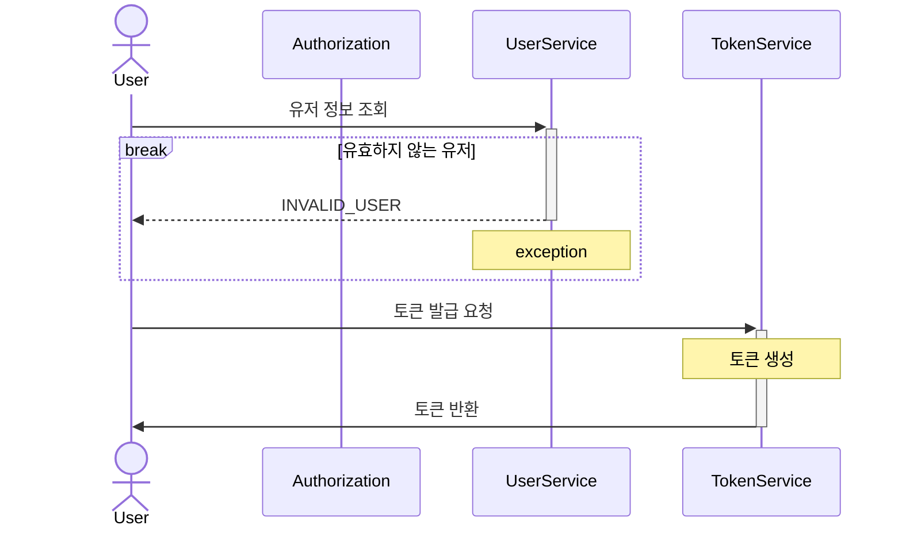
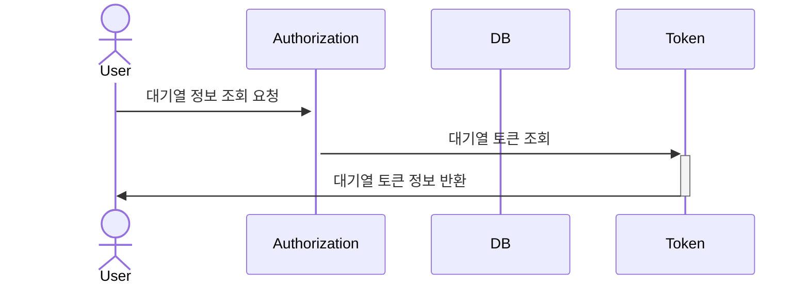
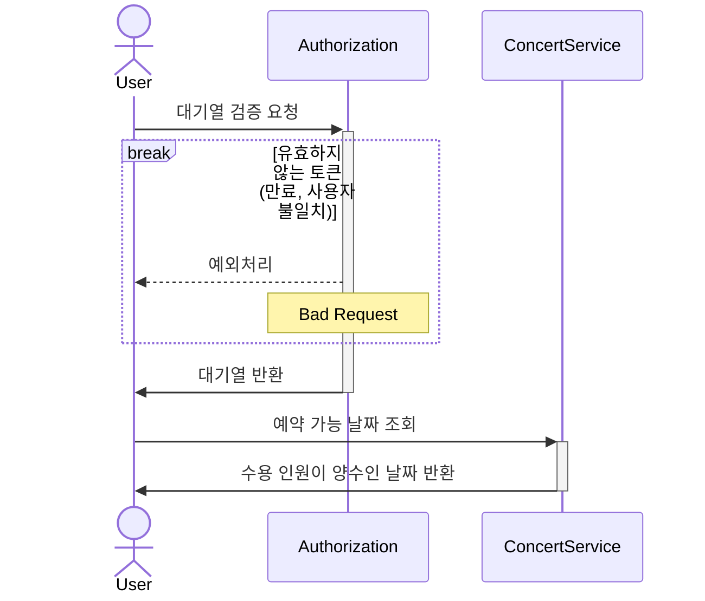
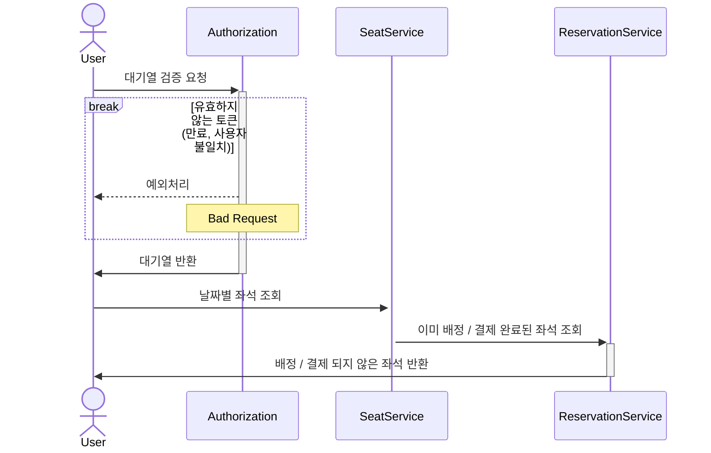
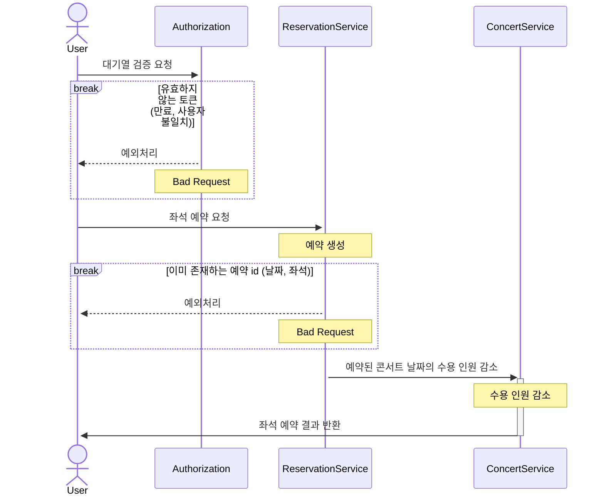
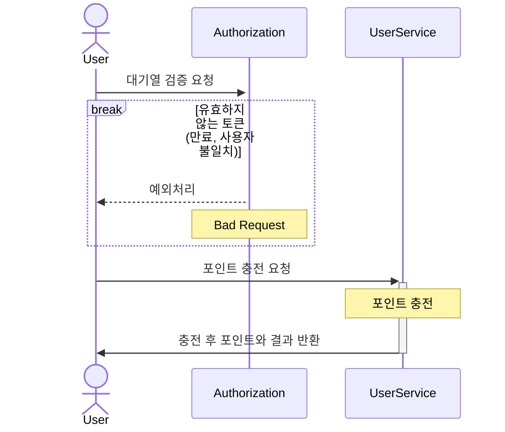
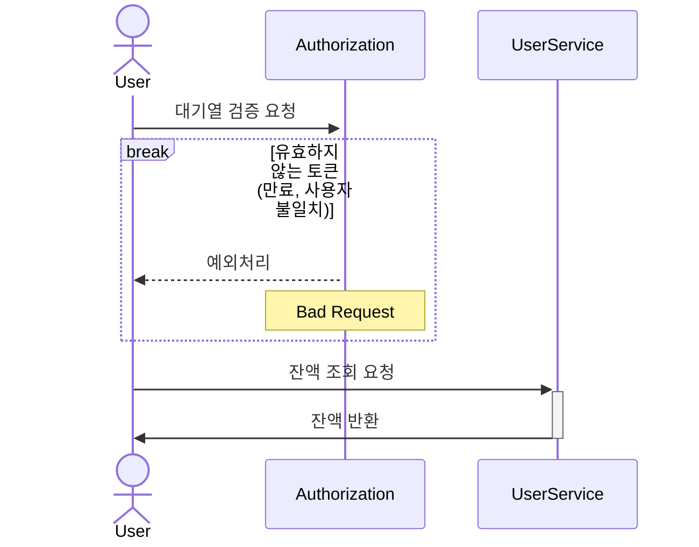
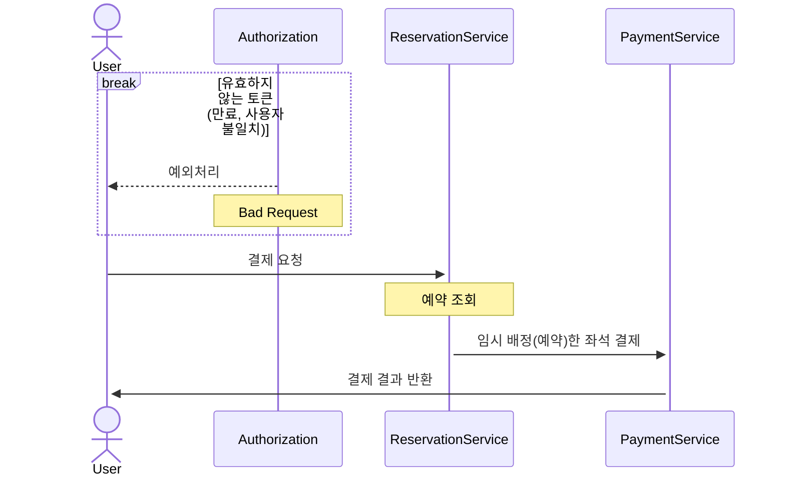
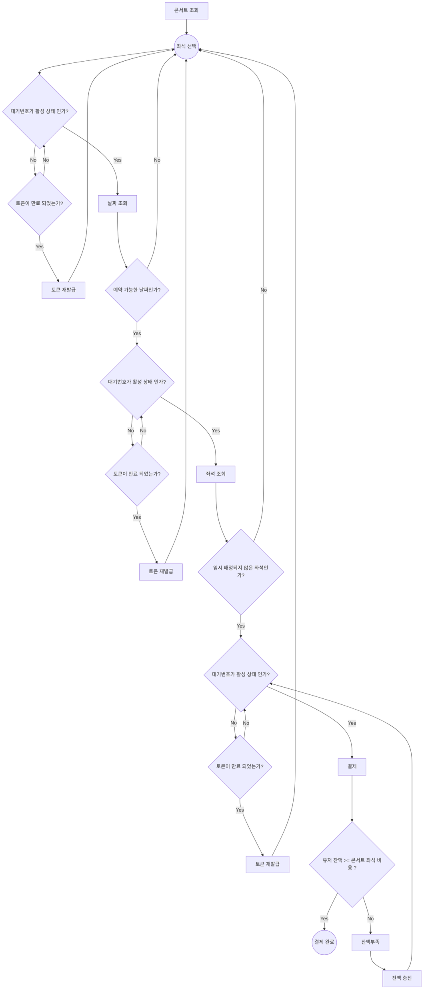
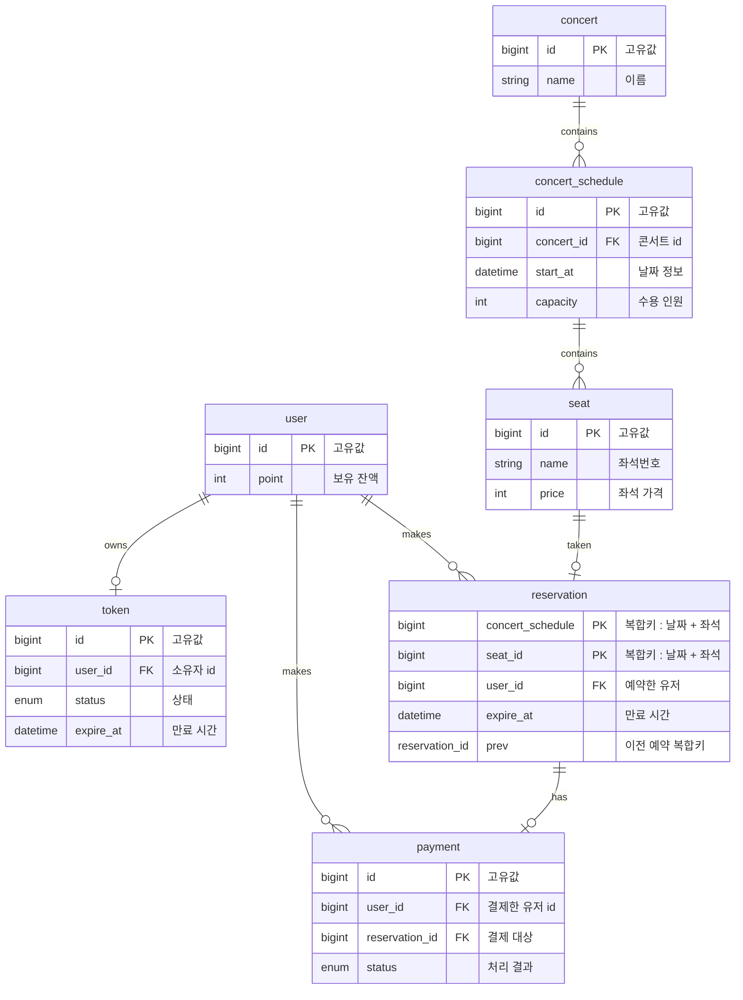

# hhplus-concert-reservation-service-java
[ Chapter 2 과제 ] 콘서트 예약 서비스

<details>
<summary style="font-size: 1.5em; font-weight: bold">Description</summary>

- `콘서트 예약 서비스`를 구현해 봅니다.
- 대기열 시스템을 구축하고, 예약 서비스는 작업가능한 유저만 수행할 수 있도록 해야합니다.
- 사용자는 좌석예약 시에 미리 충전한 잔액을 이용합니다.
- 좌석 예약 요청시에, 결제가 이루어지지 않더라도 일정 시간동안 다른 유저가 해당 좌석에 접근할 수 없도록 합니다.
</details>


<details>
<summary style="font-size: 1.5em; font-weight: bold">Milestone</summary>

https://github.com/users/adiospain/projects/10

</details>

<details>
  <summary style="font-size: 1.5em; font-weight: bold">Sequence Diagram</summary>


  <details>
  <summary style="font-size: 1em; margin-left: 20px;">issueToken -유저 토큰 발급</summary>

  <!-- Here you can include the details of the issueToken -->

유저가 서비스 이용시 필요한 대기열 토큰을 발급 받는다.

</details>
 <details>
  <summary style="font-size: 1em;margin-left: 20px;">getTokenDetail - 대기열 토큰 조회 </summary>

유저가 대기열의 대기순서 및 잔여시간을 확인한다.

- 기본적으로 폴링으로 대기열을 확인하지만, 다른 방안 (실시간)을 고려해본다.

</details>

<details>
  <summary style="font-size: 1em;margin-left: 20px;">getConcertDate - 콘서트 예약 가능 날짜 조회</summary>

유저가 예약 가능한 날짜 목록을 확인한다.


</details>
<details>
  <summary style="font-size: 1em;margin-left: 20px;">getConcertSeat - 콘서트 예약 가능 좌석 조회</summary>

유저가 예약 가능한 좌석 목록을 확인한다.
- 날짜 정보를 입력 받아 좌석 정보를 조회한다.


</details>

<details>
  <summary style="font-size: 1em;margin-left: 20px;">reserveSeat - 좌석 예약</summary>

유저가 좌석 예약한다.
- 날짜와 좌석 정보를 입력 받아 좌석을 예약 처리 한다.
- 좌석 예약과 동시에 해당 좌석은 그 유저에게 임시 배정된다.
- 배정 시간 내에 결제가 완료되지 않으면 임시 배정은 해제 된다.


</details>

<details>
  <summary style="font-size: 1em;margin-left: 20px;">chargePoint - 유저 잔액 충전</summary>

유저가 금액을 충전한다.
- 사용자 식별자와 충전할 금액을 받아 잔액에 추가한다.


</details>

<details>
  <summary style="font-size: 1em;margin-left: 20px;">getPoint - 유저 잔액 조회</summary>

유저가 잔액을 조회한다.
- 사용자 식별자를 통해 해당 사용자의 잔액을 조회한다.


</details>

<details>
  <summary style="font-size: 1em;margin-left: 20px;">createPayment - 결제</summary>

유저가 임시 배정된 좌석을 결제한다.
- 결제 처리한 후 결제 내역을 생성한다.
- 결제 완료 시 임시 배정됐던 좌석을 유저에게 배정한다.
- 유저의 대기열 토큰을 만료시킨다.

</details>
</details>


<details>
<summary style="font-size: 1.5em; font-weight: bold">Flow Chart</summary>

- 콘서트 날짜 테이블 행에 비관적 락을 걸며 수용 인원을 확인하여 예약 가능한 날짜인지 확인 합니다.
- 수용 인원 수만큼 대기열을 진입하게 하고 수용 인원을 감소해줍니다.
- 이미 예약된 좌석을 선택한 유저의 수를 합산하여 수용 인원에 더해줍니다. 



</details>

<details>
<summary style="font-size: 1.5em; font-weight: bold">ERD</summary>



</details>

<details>
  <summary style="font-size: 1.5em; font-weight: bold">API Documentation</summary>

- 클라이언트에서 토큰을 헤더에 담아 요청을 보낸다고 가정 합니다.
- 토큰은 유저Id 대기 순서, 만료 시간 정보가 인코딩 되어 있습니다.
- 단 과제를 위해 헤더에 토큰이 없어도 DB에 토큰 정보를 참조하도록 설계합니다.

<details style="margin-left: 20px;">
<summary style="font-size: 1em; font-weight: bold;">User</summary>
<details style="margin-left: 30px;">
<summary style="font-size: 1em">POST /api/users/{userId}/token - 유저 토큰 발급</summary>
- Response

```
[
	{
		"token": string
	}
]
```

- Statuse code
    - 200: OK. 발급 완료
    - 400: Bad Request. 유효하지 않은 유저ID
    - 401: Unauthorized. 유효하지 않거나 만료된 토큰
    - 403: Forbidden: 허가되지 않은 접근
</details>
<details style="margin-left: 30px;">
<summary>GET /api/users/{userId}/point - 유저 잔액 조회</summary>

- Request
```
[
	header{
		"token" : string
	}
]
```
- Response
```
[
	{
		"point": number
	}
]

```
- Status code
    - 200: OK. 조회 완료
    - 400: Bad Request. 유효하지 않은 유저ID
    - 401: Unauthorized. 유효하지 않거나 만료된 토큰
    - 403: Forbidden: 허가되지 않은 접근
</details>
<details style="margin-left: 30px;">
<summary>POST /api/users/{userId}/charge - 유저 잔액 충전</summary>

- Request
```
[
	header{
		"token": string
	}
	body{
		"amount": number
	}
]	
```
- Response
```
[
	{
		"point": number
		"status": boolean
	}
]
```
- Status code
    - 200: OK. 충전 완료
    - 400: Bad Request. 유효하지 않은 유저ID / 충전 값
    - 401: Unauthorized. 유효하지 않거나 만료된 토큰
    - 403: Forbidden: 허가되지 않은 접근
		
</details>
</details>

<details style="margin-left: 20px;">
<summary style="font-size: 1em; font-weight: bold">Concert</summary>

<details style="margin-left: 30px;">
<summary>GET /api/concerts?available={true}&page={pageNum}&pageSize={pageSize} - 콘서트 목록 조회</summary>

- Request

```
[
	header{
		"token": string
	}
]
```

- Response
- 
```
[
	[
		{
			"concertId": number,
			"name": string
		}
	]
]
```

- Status code
  - 200: OK. 조회 완료
  - 400: Bad Request. 유효하지 않은 유저ID
  - 401: Unauthorized. 유효하지 않거나 만료된 토큰
  - 403: Forbidden: 허가되지 않은 접근
</details>

<details style="margin-left: 30px;">
<summary>GET /api/concerts/{concertId} - 콘서트 상세 조회</summary>

- Request
```
[
	header{
		"token": string
	}
]
```

- Response
```
[
	{
		"concertId": number,
		"name": string,
		"concertSchedule": [
			{
				"concertScheduleId": number,
				"open_at": date,
				"seat": number
			}
		]
	}
]
```

- Status code

    - 200: OK. 조회 완료
    - 400: Bad Request. 유효하지 않은 유저ID
    - 401: Unauthorized. 유효하지 않거나 만료된 토큰
    - 403: Forbidden: 허가되지 않은 접근
</details>

<details style="margin-left: 30px;">
<summary>GET /api/concerts/{concertId}/schedules?available=true - 콘서트 예약 가능 날짜 조회</summary>
- Request

```
[
	header{
		"token": string
	}
]
```

- Response
```
[
	"concertSchedule": 
		[
			{
				"concertScheduleId": number,
				"open_at": date,
				"seats": number
			}
		]
]
```
- Status code
    - 200: OK. 조회 완료
    - 400: Bad Request. 유효하지 않은 유저ID
    - 401: Unauthorized. 유효하지 않거나 만료된 토큰
    - 403: Forbidden: 허가되지 않은 접근
</details>

<details style="margin-left: 30px;">
<summary>GET /api/concerts/{concertId}/schedules/{concertScheduleId}/seats?available={true} - 콘서트 예약 가능 좌석 조회</summary>

- Request
```
[
	header{
		"token": string
	}
]
```

- Response
```
[
	"seats": 
		[
			"seatId": number,
			"name": string,
			"reserved": boolean,
			"price": number
		]
]
```

- Status code
    - 200: OK. 조회 완료
    - 400: Bad Request. 유효하지 않은 유저ID / 콘서트 관련 ID
    - 401: Unauthorized. 유효하지 않거나 만료된 토큰
    - 403: Forbidden: 허가되지 않은 접근
</details>

</details>
<details style="margin-left: 20px;">
<summary style="font-size: 1em; font-weight: bold">Reservation</summary>
<details style="margin-left: 30px;">
<summary style="font-size: 1em; font-weight: bold">POST /api/reservation - 좌석 예약</summary>

- Request
```
[
	header{
		"token": string
	}
	body{
		"concertId": number,
		"concertScheduleId": number,
		"seatId": number
	}
]
```

- Response
```
[
	{
		"status": boolean
	}
]
```

- Status code
    - 200: OK. 예약 완료
    - 400: Bad Request. 유효하지 않은 유저ID / 콘서트 관련 ID
    - 401: Unauthorized. 유효하지 않거나 만료된 토큰
    - 403: Forbidden: 허가되지 않은 접근
</details>
</details>

<details style="margin-left: 20px;">
<summary style="font-size: 1em; font-weight: bold">Payment</summary>
<details style="margin-left: 30px;">
<summary style="font-size: 1em; font-weight: bold">POST /api/payments?concertId={concertId}&concertScheduleId={concertScheduleId}&seatId={seatId} - 결제</summary>

- Request
```
[
	header{
		"token": string
	}
	body{
		"price": number
	}
]
```

- Response
```
[
	{
		"paymentId": number,
		"status": enum, //예외 케이스 처리 (잔액 부족)
		"price": number,
		"point": number
	}
]
```
- Status code
    - 200: OK. 결제 완료
    - 400: Bad Request. 유효하지 않은 유저ID / 콘서트 관련 ID / 결제금액
    - 401: Unauthorized. 유효하지 않거나 만료된 토큰
    - 403: Forbidden: 허가되지 않은 접근
</details>

</details>

</details>
<details>
  <summary style="font-size: 1.5em; font-weight: bold">Swagger</summary>
	

 
 


</details>
