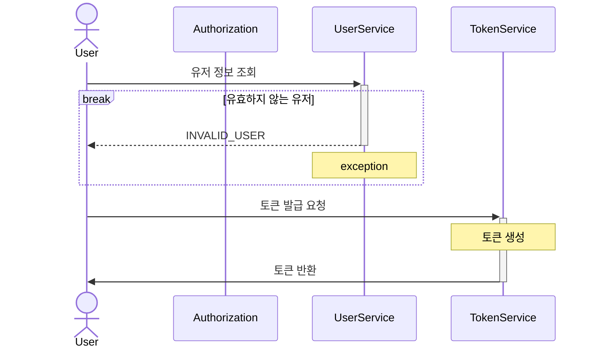
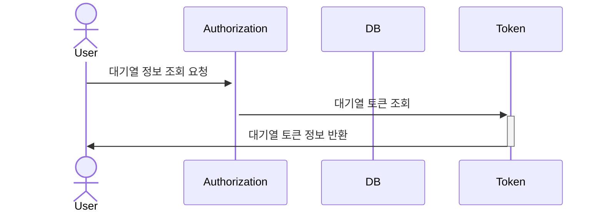
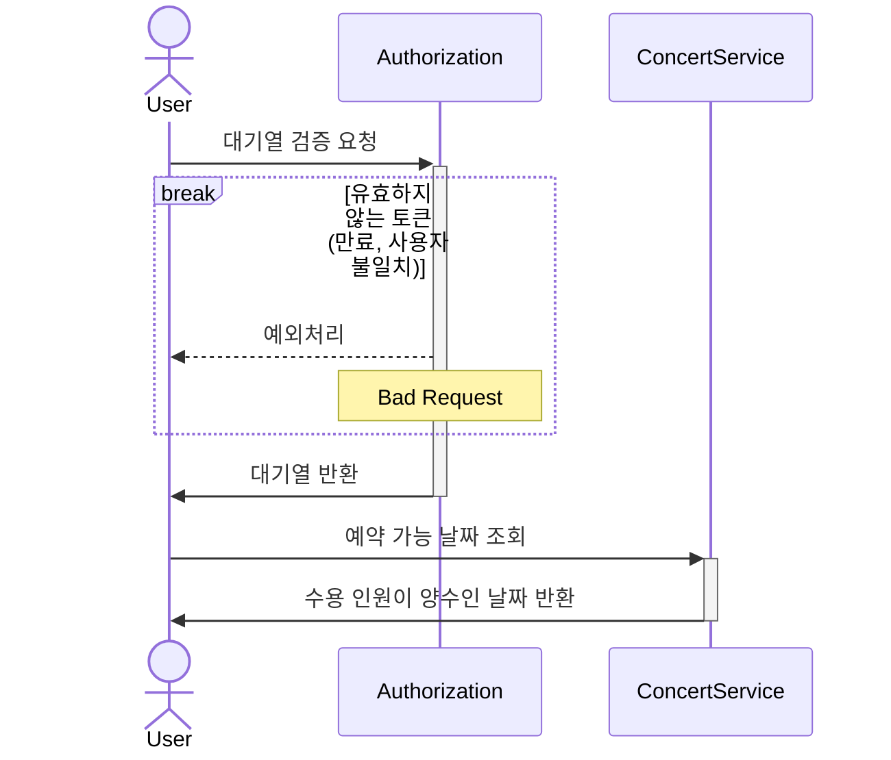
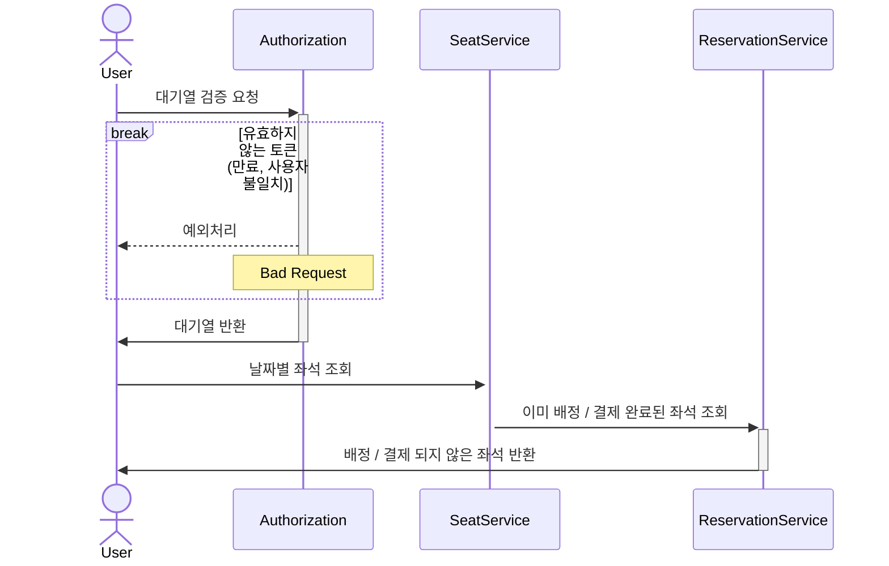
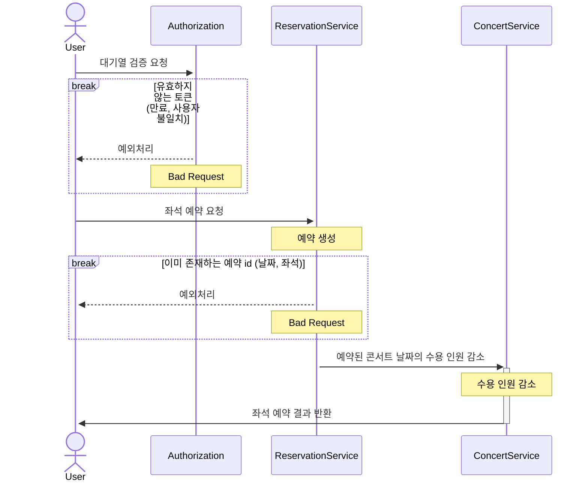
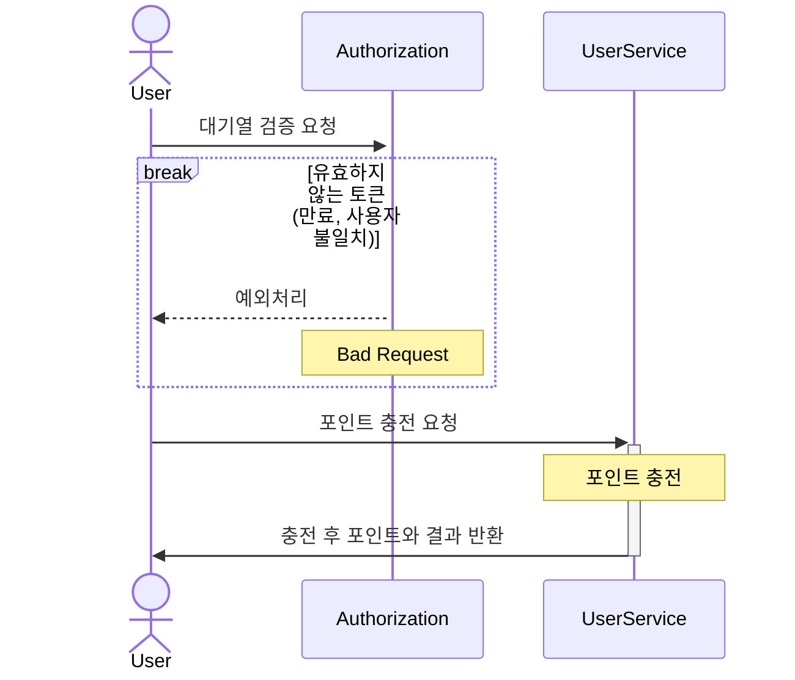
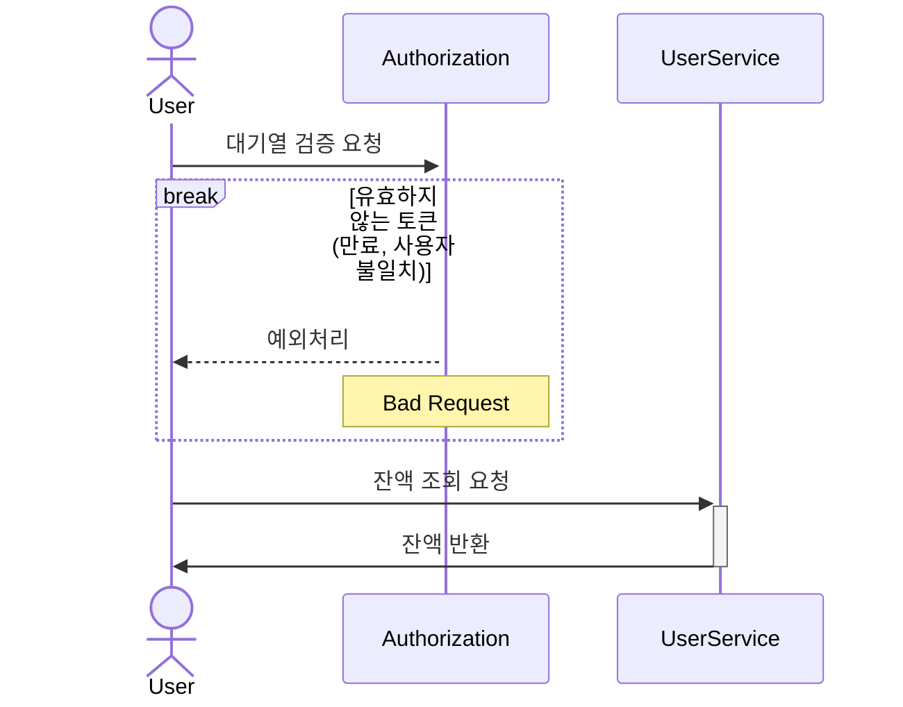
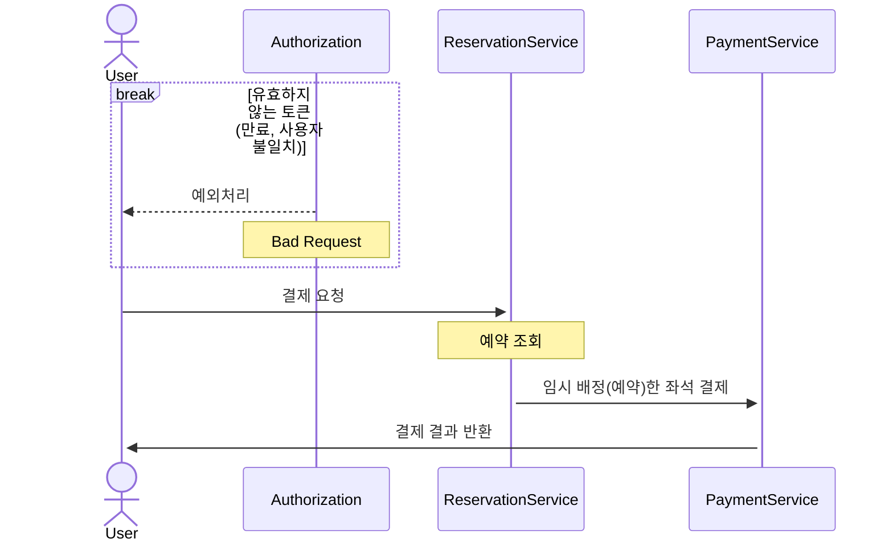
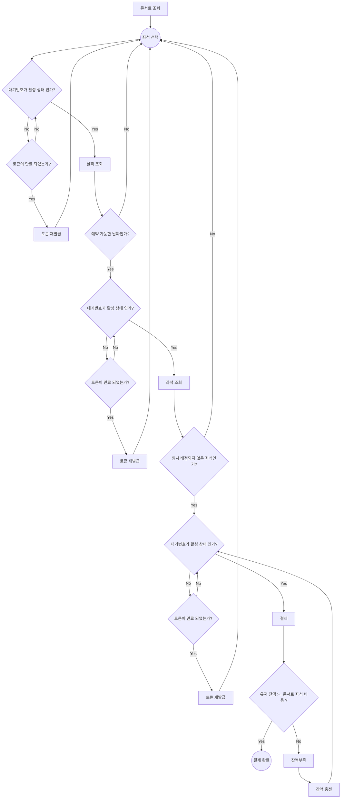
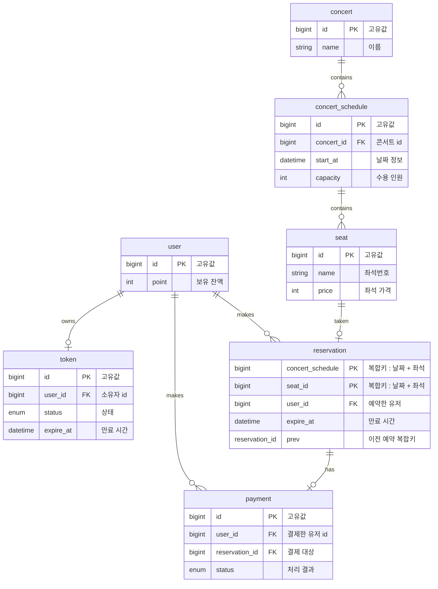

# hhplus-concert-reservation-service-java
[ Chapter 2 과제 ] 콘서트 예약 서비스

<details>
<summary style="font-size: 1.5em; font-weight: bold">Description</summary>

- `콘서트 예약 서비스`를 구현해 봅니다.
- 대기열 시스템을 구축하고, 예약 서비스는 작업가능한 유저만 수행할 수 있도록 해야합니다.
- 사용자는 좌석예약 시에 미리 충전한 잔액을 이용합니다.
- 좌석 예약 요청시에, 결제가 이루어지지 않더라도 일정 시간동안 다른 유저가 해당 좌석에 접근할 수 없도록 합니다.
</details>


<details>
<summary style="font-size: 1.5em; font-weight: bold">Milestone</summary>

https://github.com/users/adiospain/projects/10

</details>

<details>
  <summary style="font-size: 1.5em; font-weight: bold">Sequence Diagram</summary>


  <details>
  <summary style="font-size: 1em; margin-left: 20px;">issueToken -유저 토큰 발급</summary>

  <!-- Here you can include the details of the issueToken -->

유저가 서비스 이용시 필요한 대기열 토큰을 발급 받는다.

</details>
 
  <summary style="font-size: 1em;margin-left: 20px;">getTokenDetail - 대기열 토큰 조회 </summary>

유저가 대기열의 대기순서 및 잔여시간을 확인한다.

- 기본적으로 폴링으로 대기열을 확인하지만, 다른 방안 (실시간)을 고려해본다.

</details>

<details>
  <summary style="font-size: 1em;margin-left: 20px;">getConcertDate - 콘서트 예약 가능 날짜 조회</summary>

유저가 예약 가능한 날짜 목록을 확인한다.


</details>
<details>
  <summary style="font-size: 1em;margin-left: 20px;">getConcertSeat - 콘서트 예약 가능 좌석 조회</summary>

유저가 예약 가능한 좌석 목록을 확인한다.
- 날짜 정보를 입력 받아 좌석 정보를 조회한다.


</details>

<details>
  <summary style="font-size: 1em;margin-left: 20px;">reserveSeat - 좌석 예약</summary>

유저가 좌석 예약한다.
- 날짜와 좌석 정보를 입력 받아 좌석을 예약 처리 한다.
- 좌석 예약과 동시에 해당 좌석은 그 유저에게 임시 배정된다.
- 배정 시간 내에 결제가 완료되지 않으면 임시 배정은 해제 된다.


</details>

<details>
  <summary style="font-size: 1em;margin-left: 20px;">chargePoint - 유저 잔액 충전</summary>

유저가 금액을 충전한다.
- 사용자 식별자와 충전할 금액을 받아 잔액에 추가한다.


</details>

<details>
  <summary style="font-size: 1em;margin-left: 20px;">getPoint - 유저 잔액 조회</summary>

유저가 잔액을 조회한다.
- 사용자 식별자를 통해 해당 사용자의 잔액을 조회한다.


</details>

<details>
  <summary style="font-size: 1em;margin-left: 20px;">createPayment - 결제</summary>

유저가 임시 배정된 좌석을 결제한다.
- 결제 처리한 후 결제 내역을 생성한다.
- 결제 완료 시 임시 배정됐던 좌석을 유저에게 배정한다.
- 유저의 대기열 토큰을 만료시킨다.

</details>
</details>


<details>
<summary style="font-size: 1.5em; font-weight: bold">Flow Chart</summary>

- 콘서트 날짜 테이블 행에 비관적 락을 걸며 수용 인원을 확인하여 예약 가능한 날짜인지 확인 합니다.
- 수용 인원 수만큼 대기열을 진입하게 하고 수용 인원을 감소해줍니다.
- 이미 예약된 좌석을 선택한 유저의 수를 합산하여 수용 인원에 더해줍니다. 



</details>

<details>
<summary style="font-size: 1.5em; font-weight: bold">ERD</summary>



</details>

<details>
  <summary style="font-size: 1.5em; font-weight: bold">API Documentation</summary>

- 클라이언트에서 토큰을 헤더에 담아 요청을 보낸다고 가정 합니다.
- 토큰은 유저Id 대기 순서, 만료 시간 정보가 인코딩 되어 있습니다.
- 단 과제를 위해 헤더에 토큰이 없어도 DB에 토큰 정보를 참조하도록 설계합니다.

<details style="margin-left: 20px;">
<summary style="font-size: 1em; font-weight: bold;">User</summary>
<details style="margin-left: 30px;">
<summary style="font-size: 1em">POST /api/users/{userId}/token - 유저 토큰 발급</summary>
- Response

```
[
	{
		"token": string
	}
]
```

- Statuse code
    - 200: OK. 발급 완료
    - 400: Bad Request. 유효하지 않은 유저ID
    - 401: Unauthorized. 유효하지 않거나 만료된 토큰
    - 403: Forbidden: 허가되지 않은 접근
</details>
<details style="margin-left: 30px;">
<summary>GET /api/users/{userId}/point - 유저 잔액 조회</summary>

- Request
```
[
	header{
		"token" : string
	}
]
```
- Response
```
[
	{
		"point": number
	}
]

```
- Status code
    - 200: OK. 조회 완료
    - 400: Bad Request. 유효하지 않은 유저ID
    - 401: Unauthorized. 유효하지 않거나 만료된 토큰
    - 403: Forbidden: 허가되지 않은 접근
</details>
<details style="margin-left: 30px;">
<summary>POST /api/users/{userId}/charge - 유저 잔액 충전</summary>

- Request
```
[
	header{
		"token": string
	}
	body{
		"amount": number
	}
]	
```
- Response
```
[
	{
		"point": number
		"status": boolean
	}
]
```
- Status code
    - 200: OK. 충전 완료
    - 400: Bad Request. 유효하지 않은 유저ID / 충전 값
    - 401: Unauthorized. 유효하지 않거나 만료된 토큰
    - 403: Forbidden: 허가되지 않은 접근
		
</details>
</details>

<details style="margin-left: 20px;">
<summary style="font-size: 1em; font-weight: bold">Concert</summary>

<details style="margin-left: 30px;">
<summary>GET /api/concerts?available={true}&page={pageNum}&pageSize={pageSize} - 콘서트 목록 조회</summary>

- Request

```
[
	header{
		"token": string
	}
]
```

- Response
- 
```
[
	[
		{
			"concertId": number,
			"name": string
		}
	]
]
```

- Status code
  - 200: OK. 조회 완료
  - 400: Bad Request. 유효하지 않은 유저ID
  - 401: Unauthorized. 유효하지 않거나 만료된 토큰
  - 403: Forbidden: 허가되지 않은 접근
</details>

<details style="margin-left: 30px;">
<summary>GET /api/concerts/{concertId} - 콘서트 상세 조회</summary>

- Request
```
[
	header{
		"token": string
	}
]
```

- Response
```
[
	{
		"concertId": number,
		"name": string,
		"concertSchedule": [
			{
				"concertScheduleId": number,
				"open_at": date,
				"seat": number
			}
		]
	}
]
```

- Status code

    - 200: OK. 조회 완료
    - 400: Bad Request. 유효하지 않은 유저ID
    - 401: Unauthorized. 유효하지 않거나 만료된 토큰
    - 403: Forbidden: 허가되지 않은 접근
</details>

<details style="margin-left: 30px;">
<summary>GET /api/concerts/{concertId}/schedules?available=true - 콘서트 예약 가능 날짜 조회</summary>
- Request

```
[
	header{
		"token": string
	}
]
```

- Response
```
[
	"concertSchedule": 
		[
			{
				"concertScheduleId": number,
				"open_at": date,
				"seats": number
			}
		]
]
```
- Status code
    - 200: OK. 조회 완료
    - 400: Bad Request. 유효하지 않은 유저ID
    - 401: Unauthorized. 유효하지 않거나 만료된 토큰
    - 403: Forbidden: 허가되지 않은 접근
</details>

<details style="margin-left: 30px;">
<summary>GET /api/concerts/{concertId}/schedules/{concertScheduleId}/seats?available={true} - 콘서트 예약 가능 좌석 조회</summary>

- Request
```
[
	header{
		"token": string
	}
]
```

- Response
```
[
	"seats": 
		[
			"seatId": number,
			"name": string,
			"reserved": boolean,
			"price": number
		]
]
```

- Status code
    - 200: OK. 조회 완료
    - 400: Bad Request. 유효하지 않은 유저ID / 콘서트 관련 ID
    - 401: Unauthorized. 유효하지 않거나 만료된 토큰
    - 403: Forbidden: 허가되지 않은 접근
</details>

</details>
<details style="margin-left: 20px;">
<summary style="font-size: 1em; font-weight: bold">Reservation</summary>
<details style="margin-left: 30px;">
<summary style="font-size: 1em; font-weight: bold">POST /api/reservation - 좌석 예약</summary>

- Request
```
[
	header{
		"token": string
	}
	body{
		"concertId": number,
		"concertScheduleId": number,
		"seatId": number
	}
]
```

- Response
```
[
	{
		"status": boolean
	}
]
```

- Status code
    - 200: OK. 예약 완료
    - 400: Bad Request. 유효하지 않은 유저ID / 콘서트 관련 ID
    - 401: Unauthorized. 유효하지 않거나 만료된 토큰
    - 403: Forbidden: 허가되지 않은 접근
</details>
</details>

<details style="margin-left: 20px;">
<summary style="font-size: 1em; font-weight: bold">Payment</summary>
<details style="margin-left: 30px;">
<summary style="font-size: 1em; font-weight: bold">POST /api/payments?concertId={concertId}&concertScheduleId={concertScheduleId}&seatId={seatId} - 결제</summary>

- Request
```
[
	header{
		"token": string
	}
	body{
		"price": number
	}
]
```

- Response
```
[
	{
		"paymentId": number,
		"status": enum, //예외 케이스 처리 (잔액 부족)
		"price": number,
		"point": number
	}
]
```
- Status code
    - 200: OK. 결제 완료
    - 400: Bad Request. 유효하지 않은 유저ID / 콘서트 관련 ID / 결제금액
    - 401: Unauthorized. 유효하지 않거나 만료된 토큰
    - 403: Forbidden: 허가되지 않은 접근
</details>

</details>

</details>
<details>
  <summary style="font-size: 1.5em; font-weight: bold">Swagger</summary>
	

 


</details>


<details>
<summary style="font-size: 1.5em; font-weight: bold">Reflection</summary>
쉽게 쓰여지는 코드는 없다.

Java에서 제공하는 최신 문법과 lambda식을 활용해 짧게 코드를 작성할 때마다 뿌듯함을 느꼈다.

사람마다 다르겠지만, 나는 간결함보다는 명료함을 추구한다.

사람이 이해하기 쉽고 다루기 쉬운 코드를 작성하는 것을 좋아한다.

글을 쓸 때도 마찬가지로, 이해하기 어렵고 불분명한 문장을 피하고 주어와 술어가 분명한 문장을 추구한다.

사람이 읽기 쉽다는 것은 코드의 확장성과 유지보수 측면에서 효율적인 코드를 의미하며,
이것이 곧 높은 생산성으로 이어진다는 생각이다.

개발자로서의 여정에서 가장 큰 도전 중 하나는 요구사항과 시나리오를 정확히 파악하는 것이었다.

초기에는 기술적인 구현에만 집중한 나머지, 이 부분을 소홀히 했고 그 결과 개발 일정이 지연되는 경험을 했다.


토큰 서비스를 구현할 때의 일이다.

코드를 빠르게 작성하는 데에만 집중했고,

최신 Java 문법과 lambda식을 활용해 간결한 코드를 만들어냈다.

그러나 실제 구현 과정에서 여러 문제에 부딪혔다.


요구사항 이해 부족:
토큰의 상태 변경 로직이 생각보다 복잡했다.

단순히 만료된 토큰을 처리하는 것이 아니라,

다음 토큰을 활성화하는 과정도 필요했음을 뒤늦게 깨달았다.


시나리오 고려 미흡:

다양한 상황(토큰 만료, 연결 해제 등)에 대한 처리가 필요했지만, 초기에는 이를 충분히 고려하지 못했다.

확장성 부족:

처음 작성한 코드는 간결했지만, 새로운 요구사항이 추가될 때마다 큰 변경이 필요했다.


이 경험 이후, 나는 개발 프로세스를 개선했다.

요구사항 분석과 설계에 더 많은 시간을 투자하고,

혼자 개발 하는 것이 아닌 팀원과의 커뮤니케이션을 강화했다.

또한, 다른 개발자들의 관점에서 내 코드의 가독성과 유지보수성을 점검하는 습관을 들였다.

요구사항과 시나리오를 제대로 파악하는 것은 단순한 기술적 능력이 아니었다.

프로젝트 성공을 좌우하는 핵심 능력이었다.


요구사항과 시나리오 파악은 복잡한 과정이다.

1. 다양한 이해관계자들의 니즈를 파악해야 한다.

2. 현재의 요구사항뿐만 아니라 미래의 변경 가능성도 고려해야 한다.

3. 예외 상황과 엣지 케이스를 모두 고려해야 한다.

4. 기술적 제약사항과 비즈니스 요구사항 사이의 균형을 맞춰야 한다.


이러한 복잡한 요소들을 모두 정확히 파악하고 이해하는 것은 매우 어렵다.
그리고 이 과정이 완벽하지 않으면,
그 에 따른 코드 역시 완벽할 수 없다.

결과적으로, 요구사항과 시나리오 파악의 어려움이 코드 작성의 어려움으로 이어지며,

이는 '쉽게 쓰여진 코드'가 존재하기 어려운 근본적인 이유가 된다.


따라서 쉽게 코드를 작성하기 위해서는 요구사항과 시나리오를 정확히 파악하는 능력을 향상시켜야 한다.

이는 개발자로 일하면서 평생 갈고닦아야 할 스킬이라고 생각한다.

</details>

<details>
<summary style="font-size: 1em; font-weight: bold">Concurrency Test</summary>
	
# 동시성 이슈
분산환경에서 여러 스레드가 공유자원에 접근하여 조회 / 수정 / 삭제 할 때 발생하는 문제입니다.
동시성 이슈를 해결 하기 위해 락을 사용하며 각 방법의 복잡도, 성능, 효율성을 비교해봅니다.

- 낙관적 락
- 비관적 락
- 분산락
	- Simple Lock
	- Spin Lock
	- Pub/Sub

# 유즈케이스 고려 대상
- 포인트 조회 / 충전 / 사용
- 좌석 예약

# 공통 테스트 환경
- Java : JDK 17
- DB : H2
- Test Tool : JUnit 5


# 포인트 유즈케이스
- 포인트 조회, 충전, 사용과 같은 작업에서 한 사용자로부터 들어온 중복 요청을 제외하기 위해 낙관적 락을 고려했으나, 다중 환경에서의 접근과 포인트의 정합성을 보장하기 위해 비관적 락을 사용하기로 결정했습니다. 
- 낙관적 락은 데이터 충돌을 감지하고 재시도를 통해 문제를 해결하는 방식으로, 충돌이 빈번하지 않은 상황에서 유리합니다. 그러나 금액과 관련된 작업에서는 데이터의 정확성과 일관성이 
매우 중요하므로, 비관적 락을 통해 모든 트랜잭션이 순차적으로 처리되도록 하여 데이터 무결성을 보장했습니다.


## 구현
- 비관적 락 [소스코드](https://github.com/adiospain/hhplus-concert-reservation-service-java/compare/Step_11_Point-Pessimistic...Step_11_Point-Pessimistic_Review)
- 낙관적 락 [소스코드](https://github.com/adiospain/hhplus-concert-reservation-service-java/compare/Step_11_Point-Optimistic...Step_11_Point-Optimistic_Review)
	- 지수 백오프 전략으로 재시도 로직 구현
	- 테스트 통과할 때까지 최대 재시도 횟수를 늘려가며 최적화

## 테스트 환경

- 비교 대상: 비관적 락 vs 낙관적 락
- 스레드 수: 3333개
- 작업: 포인트 조회, 충전, 사용 (각 1111번의 호출)
- 10분간 1분 간격으로 실행


## 테스트 결과
1. 처리 시간 (평균)
	- 비관적 락
		- getPoint : 1.149 ms
		- chargePoint : 1.121 ms
		- usePoint : 1.298 ms

	- 낙관적 락 
		- getPoint : 3.821ms
		- chargePoint : 2.464ms
		- usePoing : 2.443ms


## 분석


- 비관적 락
	- 충돌이 빈번한 상황에서 안정적인 성능을 보입니다.
	- 다만 동시에 많은 요청이 들어올 경우 대기 시간이 길어질 수 있으며, 트랜잭션이 오래 지속될 경우, DB 커넥션 풀을 오랫동안 점유하게 됩니다.
 이는 전체적인 처리 시간 증가로 이어질 수 있습니다.
- 낙관적 락
	- 테스트 시 빈번한 충돌 연출로 인해 최대 재시도 횟수를 20번을 하고나서야 테스트 통과할 수 있었습니다.
	- 이로 인해 처리 시간이 지연됐으며 그 결과 비관적 락 보다 처리시간이 길어졌습니다.
  - 락 요청 시 대기를 하지 않아 DB 커넥션 풀을 점유할 필요가 없지만, 재시도 로직 구현시 Application 단에서 오버헤드가 발생합니다.
  - 충전 / 사용 메서드에서 재시도가 초기 시도 횟수의 2배 발생했습니다.


낙관적 락은 1인당 1매로 제한된 콘서트 티켓팅 시스템에서 효과적일 수 있습니다.  
동시에 여러 사용자가 같은 티켓을 요청하더라도, 먼저 처리된 요청만 성공하고 나머지는 실패로 처리하는 로직을 구현할 때 유용합니다.  

비관적 락은 데이터 충돌이 빈번하게 발생하고, 모든 요청을 처리해야 하는 상황에 적합합니다.  
대표적인 예로 대학의 수강신청 시스템을 들 수 있습니다. 


비관적 락을 사용하면 데이터 일관성을 유지하면서 모든 요청을 순차적으로 처리할 수 있습니다.

그러나 비관적 락의 주요 단점은 데이터베이스 리소스, 특히 커넥션 풀을 과도하게 사용한다는 점입니다. 
일반적으로 데이터베이스 커넥션 풀의 크기는 제한되어 있어(예: 200개), 
비관적 락을 사용하면 이 커넥션들을 장시간 점유하게 됩니다. 이는 시스템의 전반적인 성능 저하로 이어질 수 있으며, 
다른 트랜잭션들이 커넥션을 기다리느라 지연되는 문제를 야기할 수 있습니다.

포인트 조회 / 충전 / 사용의 처리 시간을 고려하면 비관적 락 방식이 가장 효과적인 동시성 제어로 평가됩니다.

## 요청 순서 보장의 중요성
포인트 관련 작업은 순서에 따라 결과가 달라질 수 있습니다. 
예를 들어, 100원 차감 후 200원 증가와 200원 증가 후 100원 차감은 다른 결과를 낳습니다.
비관적 락은 이러한 요구사항을 자연스럽게 충족시키며, 충돌이 빈번한 상황에서 안정적인 성능을 보입니다.

# 예약 유즈케이스
- 같은 좌석을 여러 명이 동시에 예약을 하려고 할 때 한명에게만 좌석을 줄 수 있다는 제약이 있어
낙관적 락을 사용하여 충돌이 발생하면 즉시 예외를 발생시켜 사용자에게 빠르게 응답을 제공하고자 합니다.
- 여러 좌석을 동시에 예약하는 경우 비관적 락은 데드락 상황을 초래할 수 있습니다.

## 구현
- Unique Key
	-  `Reservation` 테이블에 `seat_id`와 `concertSchedule_id`로 유니크 키를 설정하여 중복 예약을 방지했습니다.
- 비관적 락 [소스코드](https://github.com/adiospain/hhplus-concert-reservation-service-java/compare/Step_11_Reservation-Pessimistic...Step_11_Reservation-Pessimistic_Review)
	- `ConcertScheduleSeat` 테이블 조회 시 순차적인 접근을 보장합니다.
- 낙관적 락 [소스코드](https://github.com/adiospain/hhplus-concert-reservation-service-java/compare/Step_11_Reservation-Optimistic...Step_11_Reservation-Optimistic_Review)
	- `ConcertScheduleSeat` 테이블 조회 시, ObjectOptimisticLockingFailureException 예외처리로 사용자에게 미리 중복 예약을 알릴 수 있습니다.
 - Redisson [소스코드](https://github.com/adiospain/hhplus-concert-reservation-service-java/compare/Step_11_Reservation-Redisson...Step_11_Reservation-Redisson_Review)
	 - TTL 5분, 대기 시간 0초, 락 획득 후 락 해제를 하지 않도록 설정합니다.

## 테스트 환경
- 비교 대상: 순수 Unique Key vs 비관적 락 vs 낙관적 락
- 스레드 수: 1000개
- 작업: 동시에 1000명이 하나의 좌석에 대해 예약 요청
- 10분간 1분 간격으로 실행
## 테스트 결과
1. 처리 시간 (평균)
   
   파란선 : 각 실행 처리 시간의 평균값  
   빨간선 : 낙관적 락의 평균 처리 시간  
   
   
	- 유니크 키 : 20.567 ms
		
	- 비관적 락 : 95.457 ms
		
	- 낙관적 락 : 18.046 ms
		 
		
	- 분산락 : 7.936 ms
		


## 분석 
- Unique Key (20.567 ms)
	- 세 번째로 빠른 처리 시간을 보여줍니다.
	- 데이터베이스 레벨에서 빠르게 중복을 체크하고 insert하기 때문에 효율적일 수 있습니다.
	- 동시 요청 시 요청이 빠르게 실패하고 반환 될 수 있습니다.
- 비관적 락 (95.457 ms)
	- 가장 느린 처리 시간을 보여줍니다.
	- DB 대기풀을 점유하며 순차적 접근을 용이하게 하지만, 대기 시간이 크게 발생할 수 있습니다.
- 낙관적 락 (18.046 ms)
	- 두 번째로 빠른 처리 시간을 보여줍니다.
	- `ObjectOptimisticLockingFailureException` 처리 과정에서 추가적인 시간이 소요될 수 있습니다.
- 분산락 (7.936 ms)
	- 가장 빠른 처리 시간을 보여줍니다.


콘서트 좌석을 조회하는 순간 낙관적 락을 적용하여 충돌 시 예외처리로 추가적인 트랜잭션 진행 전 중복 예약을 방지할 수 있습니다. 낙관적 락을 사용했을 때 처리 시간이 비약적으로 상승하지 않고 오히려 빠른 성능을 보여주었습니다.

이는 `OPTIMISTIC_FORCE_INCREMENT `옵션으로 인해 조회 시에도 버전 업데이트로,   
전체적인 처리 시간이 여전히 낮게 유지되고 있음을 나타냅니다.

콘서트 좌석 테이블에 별도로 예약여부 필드를 추가하고 싶지 않아
version 필드만으로 상태관리를 했습니다.

예약여부를 나타내는 별도의 필드를 추가하지 않아도, 상태관리를 명확하게 할 수 있으며
낙관적 락의 오버헤드를 줄일 수 있습니다.

현재 구현한 예약 기능으로만 봤을 때, Unique Key과 분산락을 조합 사용하는 것이 최적화된 것으로 보입니다.

순수 Unique Key 방식은 데이터베이스 레벨에서 중복 체크와 삽입을 빠르게 처리할 수 있어, 동시 요청 시에도 효율적으로 동작합니다.  
반면, 비관적 락과 낙관적 락 조합으로 각각의 특성에 따라 처리 시간이 더 길어질 수도 있고 짧아질 수 있습니다.  

# 결론
 이 결과는 특정 환경과 구현 방식에서는 가능할 수 있지만, 일반적인 경우와는 다소 차이가 있습니다.  
정확한 분석을 위해서는 더 자세한 테스트 환경 정보와 구현 세부사항, 그리고 다양한 시나리오에서의 추가 테스트가 필요할 것 같습니다.  

분산락은 Redis 서버와의 통신을 필요로 하므로, 
네트워크 트래픽이 증가할 수 있습니다. 
이는 특히 고부하 상황에서 시스템 성능에 영향을 줄 수 있습니다.

Redis 서버가 다운되거나 네트워크 연결이 끊길 경우, 
전체 시스템의 락 메커니즘이 작동하지 않을 수 있습니다. 
이는 심각한 데이터 일관성 문제를 야기할 수 있습니다.

Redis 서버 장애 시 서버의 유지보수, 모니터링, 스케일링 등 추가적인 인프라 관리가 필요합니다.

성능뿐만 아니라 시스템의 안정성, 확장성, 유지보수성 등 다른 중요한 요소들도 함께 고려해야 합니다.  
</details>
