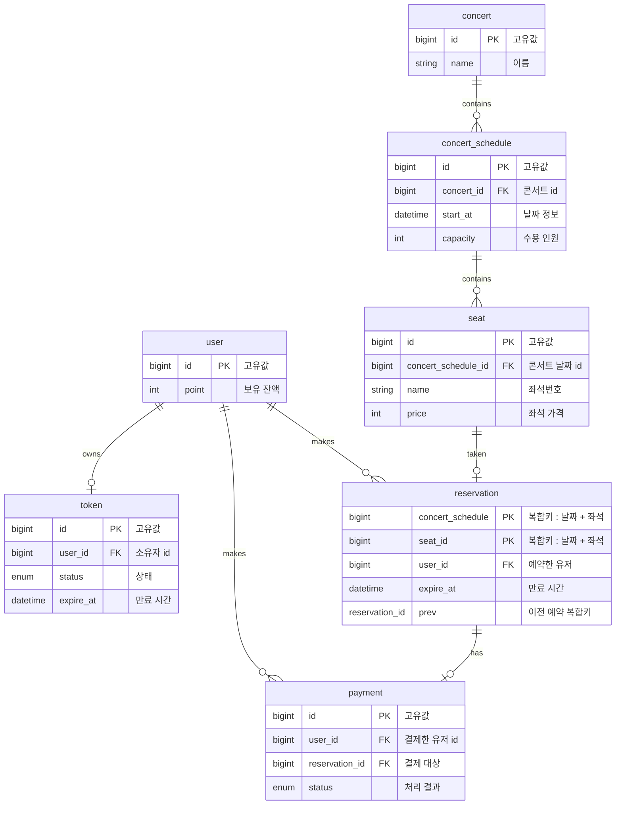

```mermaid
erDiagram

	user{
		bigint id PK "고유값"
		int point "보유 잔액"
	}
	payment {
		bigint id PK "고유값"
		bigint user_id FK "결제한 유저 id"
		bigint reservation_id FK "결제 대상"
		enum status "처리 결과"
	}
	token {
		bigint id PK "고유값"
		bigint user_id FK "소유자 id"
		enum status "상태"
		datetime expire_at "만료 시간"
	}
	concert{
		bigint id PK "고유값"
		string name "이름"
	}
	concert_schedule{
		bigint id PK "고유값"
		bigint concert_id FK "콘서트 id"
		datetime start_at "날짜 정보"
		int capacity "수용 인원"
	}
	seat{
		bigint id PK "고유값"
		bigint concert_schedule_id FK "콘서트 날짜 id"
		string name "좌석번호"
		int price "좌석 가격"	
	}
	reservation{
		bigint concert_schedule PK "복합키 : 날짜 + 좌석"
		bigint seat_id PK "복합키 : 날짜 + 좌석"
		bigint user_id FK "예약한 유저"
		datetime expire_at "만료 시간"
		reservation_id prev "이전 예약 복합키"
	}
	

	user ||--o{ payment : makes
	user ||--o{ reservation : makes
	concert ||--o{ concert_schedule : contains
	concert_schedule ||--o{ seat : contains
	reservation ||--o| payment : has
	user ||--o| token : owns
	seat ||--o| reservation : taken
```