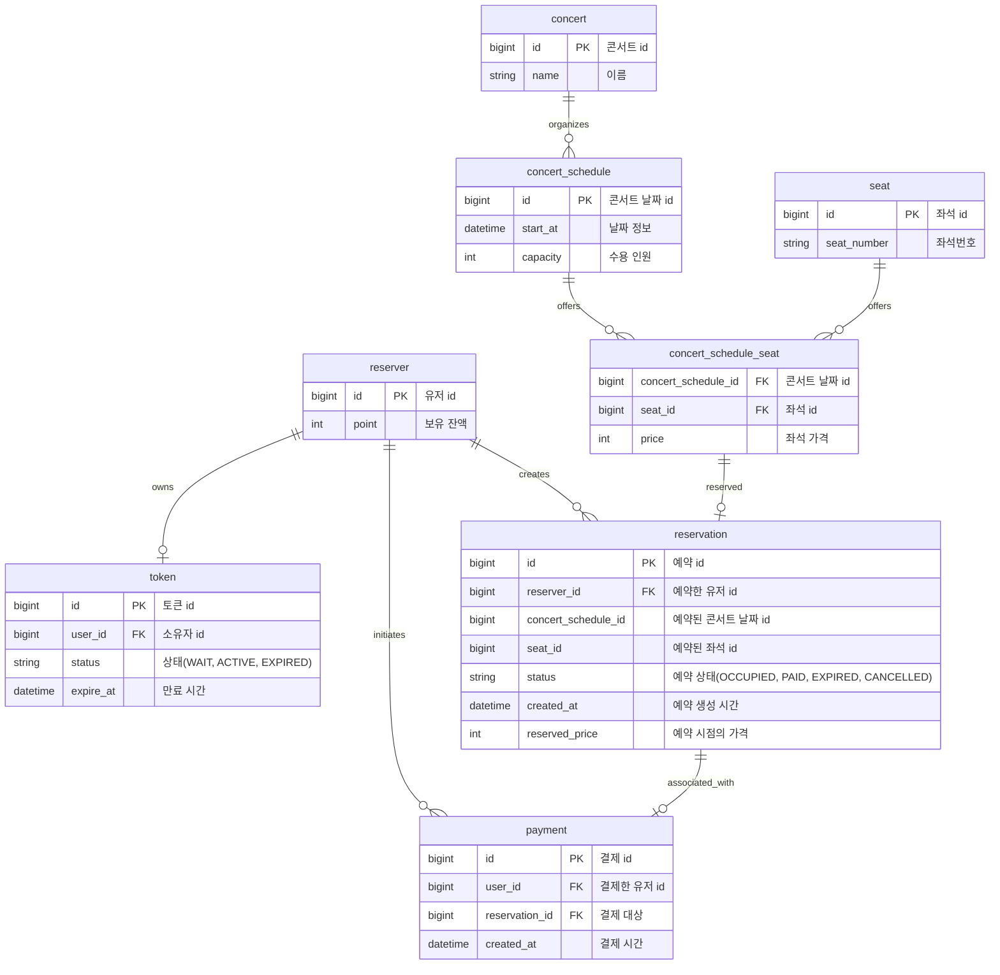

```mermaid
erDiagram

	reserver{
		bigint id PK "유저 id"
		int point "보유 잔액"
	}
	payment {
		bigint id PK "결제 id"
		bigint user_id FK "결제한 유저 id"
		bigint reservation_id FK "결제 대상"
		datetime created_at "결제 시간"
	}
	token {
		bigint id PK "토큰 id"
		bigint user_id FK "소유자 id"
		string status "상태(WAIT, ACTIVE, EXPIRED)"
		datetime expire_at "만료 시간"
	}
	concert{
		bigint id PK "콘서트 id"
		string name "이름"
	}
	concert_schedule{
        bigint id PK "콘서트 날짜 id"
		datetime start_at "날짜 정보"
		int capacity "수용 인원"
	}
	concert_schedule_seat{
	    bigint concert_schedule_id FK "콘서트 날짜 id"
	    bigint seat_id FK "좌석 id"
	    int price "좌석 가격"
    }
	
	seat{
        bigint id PK "좌석 id"
		string seat_number "좌석번호"
	}
	reservation{
	    bigint id PK "예약 id"
        bigint reserver_id FK "예약한 유저 id"
	    bigint concert_schedule_id "예약된 콘서트 날짜 id"
		bigint seat_id "예약된 좌석 id"
		string status "예약 상태(OCCUPIED, PAID, EXPIRED, CANCELLED)"
		datetime created_at "예약 생성 시간"
		int reserved_price "예약 시점의 가격"
	}
	

	reserver ||--o{ payment : initiates
    reserver ||--o{ reservation : creates
	concert ||--o{ concert_schedule : organizes
    concert_schedule ||--o{ concert_schedule_seat : offers
    seat ||--o{ concert_schedule_seat : offers
    concert_schedule_seat ||--o| reservation : reserved
	reservation ||--o| payment : associated_with
    reserver ||--o| token : owns
	
```