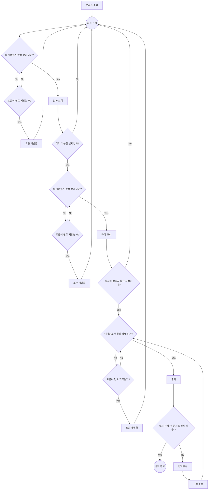

```mermaid
    flowchart TD
    ConcertView[콘서트 조회] --> ConcertSelect((좌석 선택)) 
    ConcertSelect --> CheckWaiting1{대기번호가 활성 상태 인가?}
    CheckWaiting1 --> |Yes| ConcertDateView[예약 가능한 날짜 조회]
    CheckWaiting1 --> |No| CheckExpire1{토큰이 만료 되었는가?}
    CheckExpire1 --> |Yes| RenewToken1[토큰 재발급] --> ConcertSelect
    CheckExpire1 --> |No| CheckWaiting1
    
    ConcertDateView[날짜 조회] --> CheckWaiting2-1{예약 가능한 날짜인가?}
    CheckWaiting2-1 --> |Yes| CheckWaiting2-2{대기번호가 활성 상태 인가?}
    CheckWaiting2-1 --> |No| ConcertSelect
    CheckExpire2{토큰이 만료 되었는가?} --> |Yes| RenewToken2[토큰 재발급] --> ConcertSelect
    CheckExpire2 --> |No| CheckWaiting2-2
    CheckWaiting2-2 --> |Yes| ConcertSeatView[좌석 조회]
    CheckWaiting2-2 --> |No| CheckExpire2

    ConcertSeatView --> CheckWaiting3-1{임시 배정되지 않은 좌석인가?}
    CheckWaiting3-1 --> |Yes| CheckWaiting3-2{대기번호가 활성 상태 인가?}
    CheckWaiting3-1 --> |No| ConcertSelect
    CheckExpire3{토큰이 만료 되었는가?} --> |Yes| RenewToken3[토큰 재발급]--> ConcertSelect
    CheckExpire3{토큰이 만료 되었는가?} --> |No| CheckWaiting3-2
    CheckWaiting3-2 --> |Yes| createPayment[결제]
    CheckWaiting3-2 --> |No| CheckExpire3
    
    createPayment --> checkPayment1{유저 잔액 >= 콘서트 좌석 비용 ?}
    checkPayment1 --> |Yes| completePayment((결제 완료))
    checkPayment1 --> |No| exceptionPayment[잔액부족]
    exceptionPayment --> chargePoint[잔액 충전]
    chargePoint --> CheckWaiting3-2
```