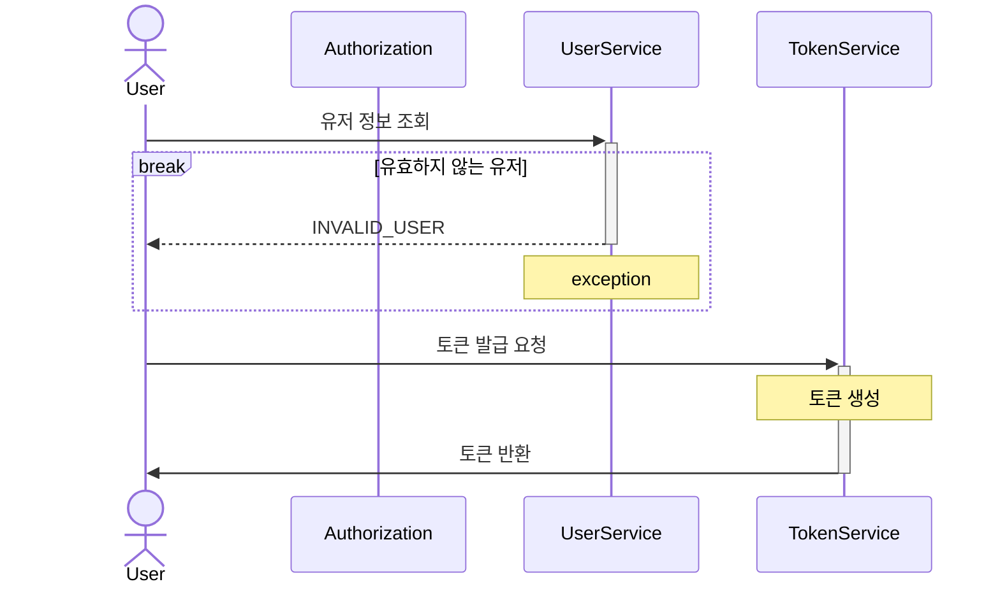
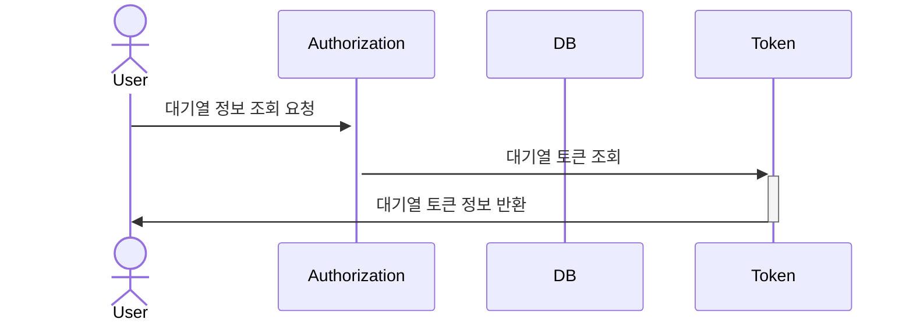
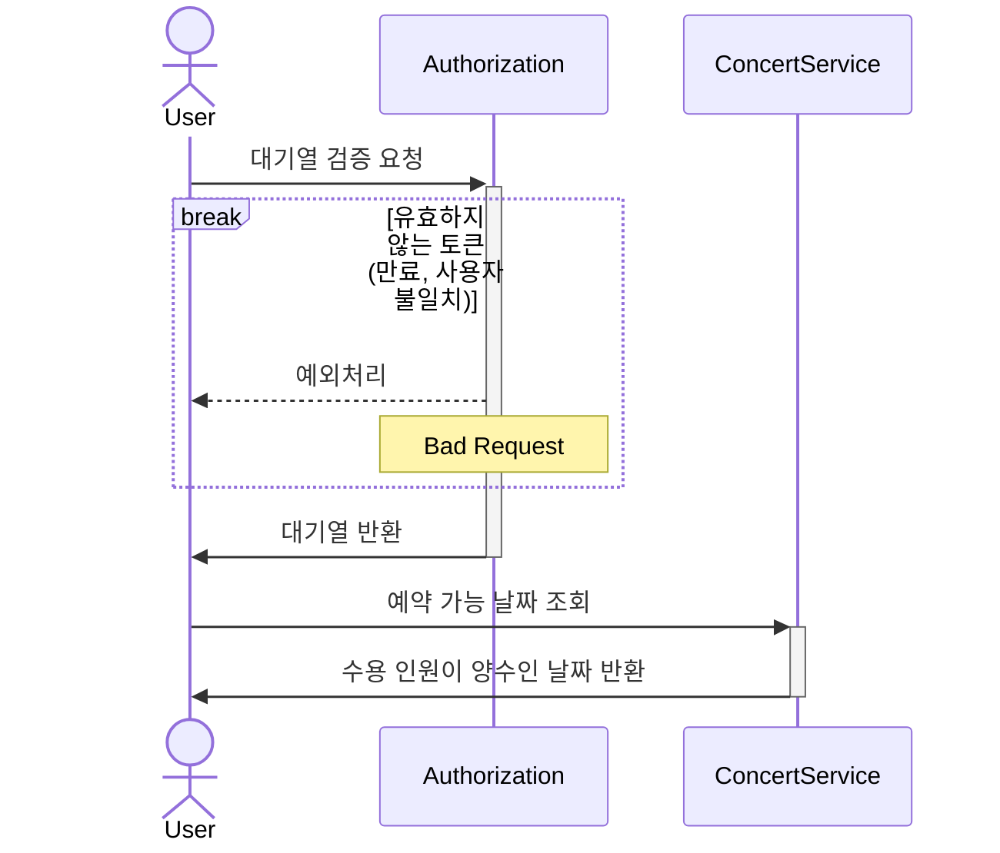
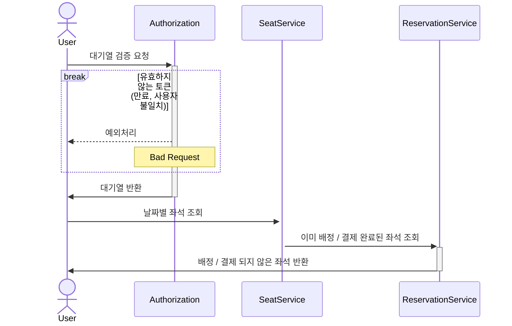
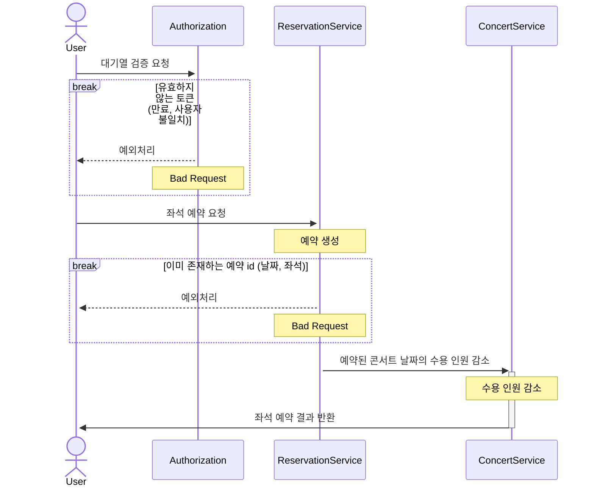
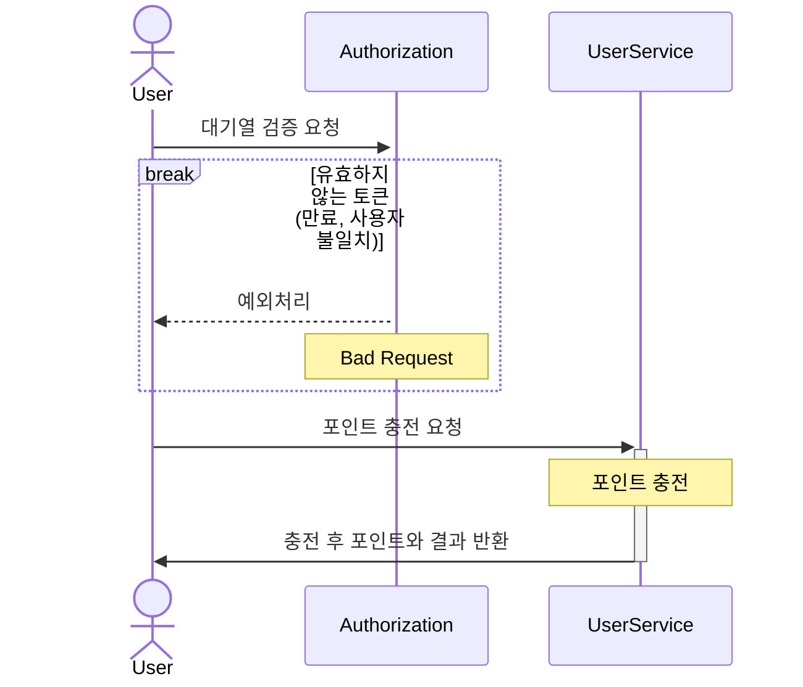
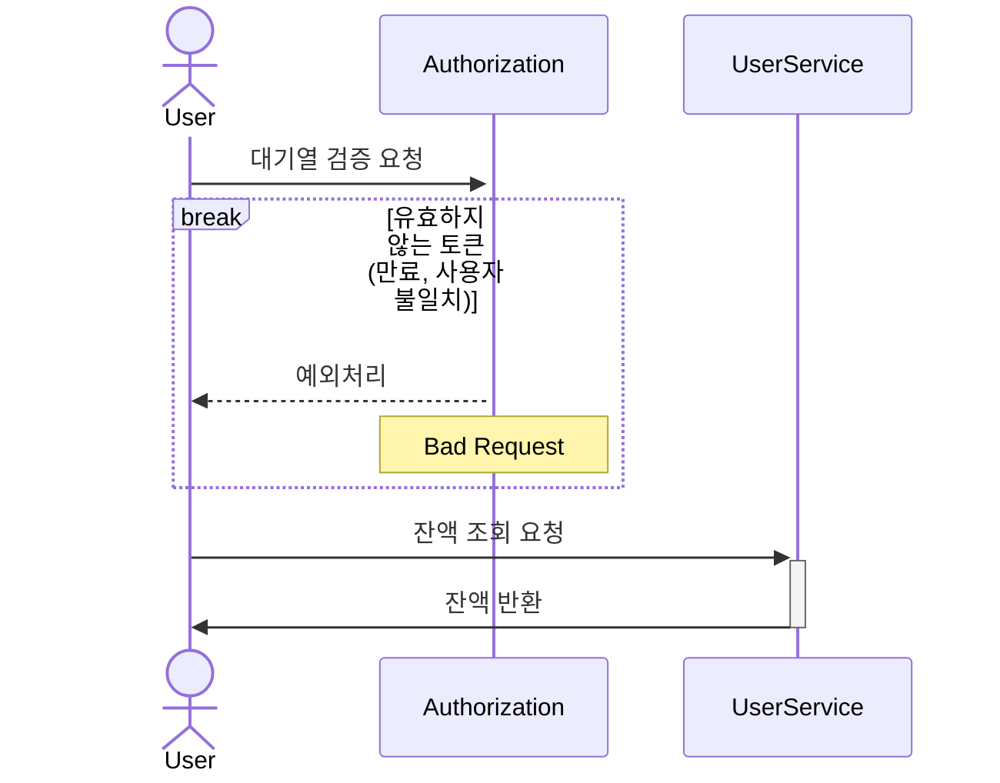
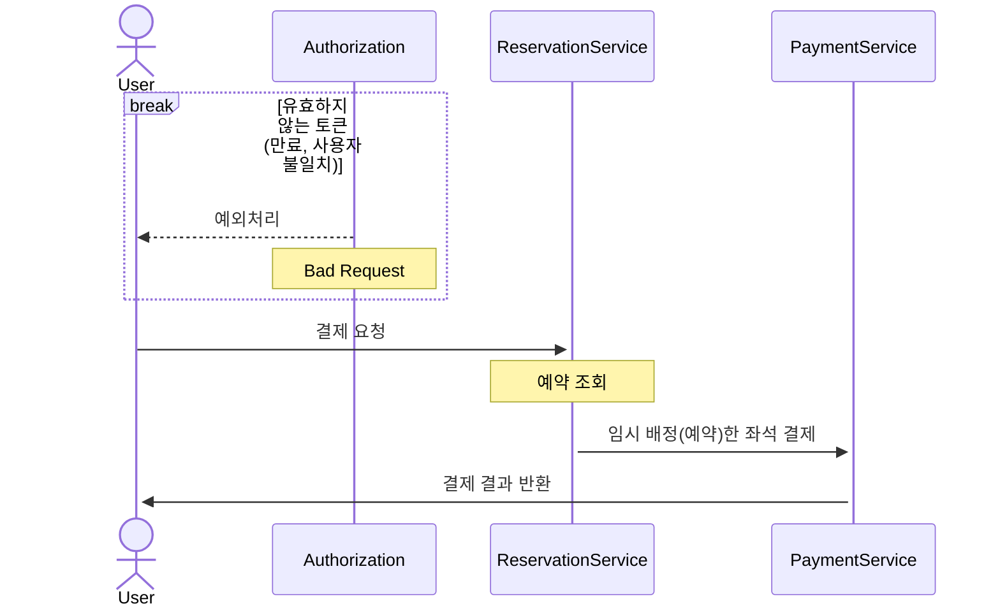

  

  
issueToken -유저 토큰 발급

  <!-- Here you can include the details of the issueToken -->

유저가 서비스 이용시 필요한 대기열 토큰을 발급 받는다.

  
getTokenDetail - 대기열 토큰 조회 

유저가 대기열의 대기순서 및 잔여시간을 확인한다.

- 기본적으로 폴링으로 대기열을 확인하지만, 다른 방안 (실시간)을 고려해본다.

  
getConcertDate - 콘서트 예약 가능 날짜 조회

유저가 예약 가능한 날짜 목록을 확인한다.

  
getConcertSeat - 콘서트 예약 가능 좌석 조회

유저가 예약 가능한 좌석 목록을 확인한다.
- 날짜 정보를 입력 받아 좌석 정보를 조회한다.

  
reserveSeat - 좌석 예약

유저가 좌석 예약한다.
- 날짜와 좌석 정보를 입력 받아 좌석을 예약 처리 한다.
- 좌석 예약과 동시에 해당 좌석은 그 유저에게 임시 배정된다.
- 배정 시간 내에 결제가 완료되지 않으면 임시 배정은 해제 된다.

  
chargePoint - 유저 잔액 충전

유저가 금액을 충전한다.
- 사용자 식별자와 충전할 금액을 받아 잔액에 추가한다.

  
getPoint - 유저 잔액 조회

유저가 잔액을 조회한다.
- 사용자 식별자를 통해 해당 사용자의 잔액을 조회한다.

  
createPayment - 결제

유저가 임시 배정된 좌석을 결제한다.
- 결제 처리한 후 결제 내역을 생성한다.
- 결제 완료 시 임시 배정됐던 좌석을 유저에게 배정한다.
- 유저의 대기열 토큰을 만료시킨다.

